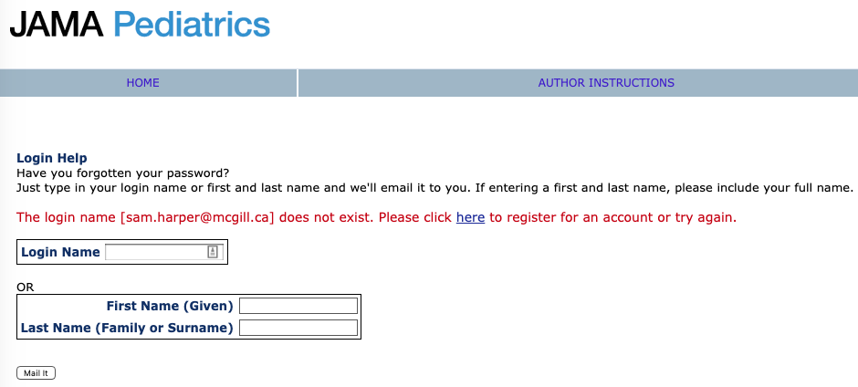

## I.

This week I saw an interesting [paper](http://www.nber.org/papers/w26364) published by NBER by D. Mark Anderson, Kyutaro Matsuzawa, and Joseph J. Sabia (an ungated version is posted on Anderson's [website](http://www.dmarkanderson.com/AMS_Marriage_Equality_Teen_Suicide_Attempts_October_3_2019v3.pdf)) about the impact of marriage equality laws on youth suicide risk. 

Obviously, this paper is interesting on it's own: Marriage equality laws may have plausible impacts on mental health, especially among marginalized populations. Anderson et al. also argue that there could be some potential negative consequences for mental health due to political backlash. Thus designing a study to evaluate the impact of legislation on youth suicide piqued my interest.

As it turns out, it seems that Anderson et al. also had *their* interest piqued by a previous paper on this topic, which was published in *JAMA Pediatrics*. They start by noting:

> A recent article published by Raifman et al. (2017) produces the first empirical evidence on the relationship between SSM legalization and youth mental health. Using data from the State Youth Risk Behavior Surveys (YRBS) for the period 1999-2015, Raifman et al. (2017) find that legalization is associated with a 0.6 percentage-point (7 percent) decline in self-reported suicide attempts among all high school students, and a 4 percentage-point (14 percent) decline in suicide attempts among those who identified as LGBQ relative to suicide attempts among heterosexual-identifying youth.

Hey...wait a minute...something seems familiar here...Oh yeah! I know that paper! In fact, I *reviewed* the Raifman (2017) paper for *JAMA Pediatrics* a couple of years ago:

Well. This is indeed interesting. Let's see where it goes...

> While there is much to admire about the pioneering efforts of Raifman et al. (2017),

Alright, I'm with you...

> we believe their conclusions deserve closer scrutiny for a number of reasons...

Ohhhh, now I think I see what's going on. This feels like replication-town (I've been there [before](https://sbh4th.github.io/post/420-update/). It can be nice, but stormy). They make a few arguments regarding limitations of the Raifman paper (which I think can be read for free [here](https://jamanetwork.com/journals/jamapediatrics/fullarticle/2604258)), summarized below. 

What are their reasons for re-evaluating this question? They give several:

- Access to additional post-treatment data;
- More flexible difference-in-difference-in-differences (yes, that) specification;
- Different level of clustering for standard errors;
- Rescaled survey weights;
- Composisitional impacts;
- More outcomes;

I won't discuss all of these, but I certainly encourage you to read the entire paper and judge for yourself. Here is Anderson et al.'s bottom line:

> Despite previous research suggesting otherwise, we find little evidence that SSM laws have reduced suicide attempts among teen sexual minorities, nor have they decreased the likelihood of suicide planning, suicide ideation, or depression. Instead, we find some evidence that SSM legalization via judicial mandate is associated with worse mental health for these individuals, consistent with
a story of social backlash.

## II.
Next, they try and replicate several of the findings of Raifman et al. (2017). I won't digress too much here, except to say that it may come as little surprise to anyone that *JAMA Pediatrics* does not require (or ask) authors to post either datasets or code that would help to facilitate straightforward computational replication. However, the data are public and the design is relatively straightforward, and Raifman et al. were pretty clear about what they did. 

Here is what Anderson et al. found when they tried to replicate the main findings:

> In column (1) of Table 3, we attempt to replicate the original findings of Raifman et al. (2017). Following Raifman et al. (2017), we estimate equation (1), adjusting standard errors for clustering at the state-by-grade level and weighting regressions using the State YRBS-provided sampling weights. As discussed above, clustering at the state-by-grade level may lead to standard errors that are too small and the State YRBS weights are not designed to be comparable across states or even within states over time. Based on this specification, we find that SSM laws are associated with a 0.66 percentage point decrease in suicide attempts among U.S. high school students. This estimate is statistically distinguishable from zero at the 5 percent level and is nearly identical to the estimate reported in Raifman et al. (2017).

*Nearly identical* estimates seems pretty great, and of course this really helps Anderson et al. make their case for how other kinds of choices may have impacted the Raifman et al. results. 

Now here is the part that got me going:

> In column (2), we correct the standard errors by adjusting them for clustering them at the level of policy variation (i.e., the state). This adjustment results in a 56 percent increase in the estimated standard error, rendering the estimate statistically indistinguishable from zero at conventional levels.

So, they find that the standard errors are sensitive to whether they are clustered at the state vs. the state-grade level. In terms of point estimates and 95% confidence intervals, here are those estimates from Anderson et al.:

| Level of clustering | Estimate (percentage points)  | 95%CI |
| ------------- | ------------- | ------------- | 
| State, grade | -0.66 | -1.2, -0.1  |
| State | -0.66  | -1.5, 0.2  |

Now, there is, of course, a larger discussion to be had about how we should feel about the difference between those two estimates. Anderson et al. focus on the new results being "statistically indistiguishingable" from the zero. If one wanted to, one could obtain the analogous [p-values](https://www.bmj.com/content/343/bmj.d2304) for these estimates, and I'm sure readers won't be surprised where that would lead. But the larger point is that dealing with clustering for group-level treatments is important and there has been a lot of discussion about it (the title of this post is a riff on a [series](https://chrisblattman.com/2015/12/08/clusterjerk/) of [blog](https://chrisblattman.com/2015/12/11/clusterjerk-the-much-anticipated-sequel/) [posts](http://john-joseph-horton.com/monte-carlo-clusterjerk/) by the economist Chris Blattman and others discussing the issue of clustered standard errors).

The other issue I'll discuss is heterogenous effects by sexual minority status. Raifman et al. (2017) reported that the impact of laws in reducing suicide attempts was stronger among sexual minorities (their estimate was -4.0 with a 95%CI of -6.9 to -1.2). However, as Anderson et al. point out, their model only forces all covariates (including state and year fixed effects) to be identical for sexual minorities and heterosexuals. They allow these to differ by using a fully interacted model and compare:

| Model | Estimate  | 95%CI |
| ------------- | ------------- | ------------- | 
| Sexual minorities (partially interacted) | -4.2 | -6.7, -1.6  |
| Sexual minorities (fully interacted)  | -1.6 | -4.9, 1.7  |

Again, the first estimates are nearly identical to Raifman et al. (2017), but this model choice has serious consequences and reduces the impact among this subpopulation, as Anderson et al. note:

> In panel II of Table 4, we restrict the sample to sexual minorities, allowing the effects of the covariates to differ for this subgroup. In this case, the absolute magnitude of the estimated policy impact falls by 67 percent; we consistently find that SSM laws are associated with a statistically insignificant 1.4 to 1.5 percentage-point reduction in suicide attempts. In panel III, we find no evidence that SSM laws affect suicide attempts among self-identified heterosexuals, and estimates from fully-interacted DDD models (panel IV) are in line with those shown in panel II, suggesting that forcing coefficients on covariates to be equal for sexual minorities and heterosexuals may not be appropriate.

## III.

Okay, so why am I going on at such length about these issues? Without trying to sound petulant (and vain), it's because I brought up both of these issues when I first reviewed the paper for *JAMA Pediatrics* in October of 2016, yet obviously neither the authors nor the editor gave these comments much consideration. 

At the risk of revealing parts of my review and, in retrospect, things I wish I might have said differently (or not at all), I'll just highlight a couple of points I made in my review. First, on the issue of covariate differences in the "partially interacted" DD model, I said:

> 9. I think the DDD idea is what the authors are getting at with this: “In the analysis focused on sexual minority youth, we estimated the interaction between state same-sex marriage and sexual minority identity and included binary control indicators for state same-sex marriage and for sexual minority identity.” but this statement is not clear to me. Including the product term between minority status and the treatment variable goes further toward the DDD type estimation, but (as far as I can tell, and since they are not mentioned in Table S2) does not account for state fixed differences in the minority-majority gap in suicide attempts (which could differ by treatment status), or for the fact that there may different secular trends for the minority and majority groups that are common to all states. These can be remedied by including product terms between the state fixed effects and minority status, and the year fixed effects and minority status.

I did not go all the way and ask for separate models, but this is effectively the same issue regarding the DDD specification that Anderson et al. are worried about. Just including a product term in a "traditional" DD model between the DD coefficient and a group indicator makes strong assumptions about the fixed effects that may not be justified. 

Similarly, on the issue of clustering:

> 11. More importantly, do the Taylor series standard errors adjust for clustering and potential serial correlation by state? I think they do, but this is an important issue in DD analysis (see the Bertrand paper already cited). I see now in the footnote to Table 2 that SEs were clustered “school and by classroom.” Cameron and Miller (J Hum Res 2015) discuss this situation in particular: “At the minimum, one should cluster at the level of the primary sampling unit though often there is reason to cluster at a broader level, such as clustering on state if regressors and errors are correlated within state.” Because it seems very likely that in the YRBS data for suicide attempts errors are correlated within state and, at a minimum, the authors should also cluster standard errors at the state level in a sensitivity analysis, though my preference would be to do this for the main analysis.

I regret saying "I think they do," since I should know better, but also felt like I wanted to be positive and give the authors the benefit of the doubt. Regardless, I thought I made it clear that I did not think the standard errors were clustered at the right level, gave some rationale for why they should be worried about it, and asked that they do this for the main analysis, or at least as a sensitivity analysis. Apparently they did not find this compelling. 

Even more frustrating, when I looked at the email from the editor giving the "Revise and Resubmit", I can now see that another reviewer made the same comment(!):

> 5. Clustering. Table 2 refers to clustering by school and classroom. But this is not described in the text. More importantly, I think the authors should show models with clustering at the state level instead of at these other levels. In general standard errors should be clustered at the level at which the treatment varies. Here, that level is state, not classroom or school. This may affect precision; results should be shown with various levels of clustering, similar to the robustness analyses currently shown.

So we have 2 reviewers (the only 2 reviewers, as far as I'm aware) both asking (with reasons) for the anlaysis to be done with SE clustered at the state level, yet what we end up with is a paper with SEs clustered at the "state and grade level". Is this what we want from peer review? And for all you counterfactualists out there, what do you think *would* have happened to this paper *at JAMA Pediatrics* had the authors clustered the standard errors at the state level?

## IV.
The purpose of this post isn't to comment specifically about the substantive issues under investigation in these papers (obviously, that is important, too). And it certainly isn't to throw stones at Raifman et al. (disclosure: I know one of the authors personally). I thought the paper had many positive qualities, but needed some additional work and robustness testing. Pretty standard for a lot of DD papers. 

My concern is about how peer review is handled. We already have a huge problem with [research waste](https://www.thelancet.com/series/research) in biomedical research, and having smart people like Anderson et al. spend lots of time correcting flaws in a paper that were previously identified during the "normal" process of peer review seems like a waste of time and resources. Why even bother with peer review at all? Had the first version of this paper been published without any peer review, my guess is that we would see much the same paper by Anderson et al. Yes, on one hand, I can see this as a great example of a well-designed replication paper. Anderson et al. found "much to admire" in Raifman et al. (2017), but also believed the results deserved to be further interrogated. Plus, they attempt to *advance* the evidence further by including more post-treatment data, taking advantage of a new potential source of exogenous variation, and looking at other outcomes. All good. 

On the other hand, however, I'm frustrated that the process of peer review in the first go around could have been more transparent. Did the editor communicate to the authors the concerns that *both* reviewers had about the clustering issue? Perhaps the authors argued against clustering at the state level in their response, but why then did we end up with "state-grade" clustering? When I spend my time reviewing a paper I generally hope that both the authors *and the editor* take my comments seriously. But I don't pretend that every comment I make in a review is equally important, or important at all. I can (and do) focus on pendantic, pet issues that bother me, but this is a case where the paper is about a serious policy (and health) issue, the authors are doing some non-standard-practice things and, as we seem to have learned from Anderson et al., these choices *actually do* make a difference to the results and interpretation. 

Perhaps it is my fault for not following up more closely. In fairness, I may have ticked the box when submitting my review that I didn't want to see the paper again, having already invested a lot of time in reviewing it and providing what I thought were helpful comments. In fact, I tried to login to the *JAMA Pediatrics* site to retrieve my review and see how the paper was handled and perhaps whether I asked not to see it again, and not only is there no record of my review, they don't even have me in the system as a peer reviewer!

What the hell kind of clown show is going on here?!

Finally, it's also important to say that NBER papers are *not* peer-reviewed and I'm sure Anderson et al.'s paper will also benefit from the scrutiny of the peer review process. I just hope that the peer reviewers who use their limited time to provide this crucial activity, **free-of-charge**, have their reports faithfully considered by editors when making judgements about the paper's merits. 
